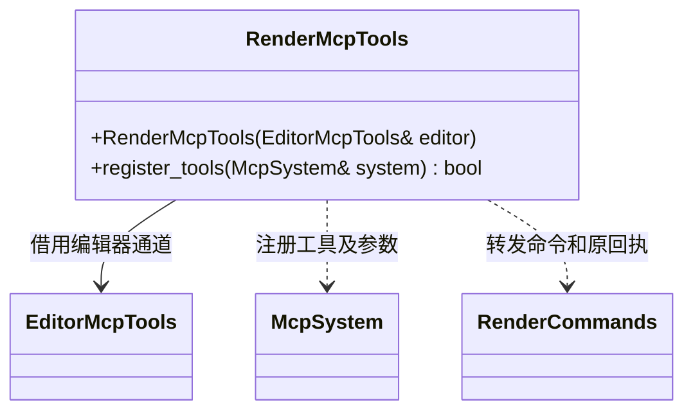

# 渲染 MCP 适配

[类图索引](../../../class-diagrams/index.md)

```mermaid
classDiagram
    class RenderMcpTools {
        +RenderMcpTools(EditorMcpTools& editor)
        +register_tools(McpSystem& system) bool
    }
    class EditorMcpTools
    class McpSystem
    class RenderCommands
    RenderMcpTools --> EditorMcpTools : 借用编辑器通道
    RenderMcpTools ..> McpSystem : 注册工具及参数
    RenderMcpTools ..> RenderCommands : 转发命令和原回执
```

工具为 get_render_settings、set_render_settings、capture_frame、get_frame_capture。路径策略与撤销归编辑器，图形和截图处理归渲染器；MCP 不生成图片，也不把已接受请求报告为完成。
