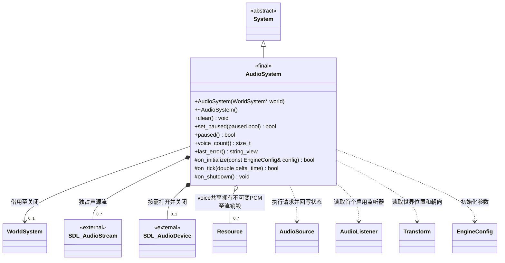

# 音频系统

[类图索引](../../class-diagrams/index.md) · [音频组件](audio-components.md) · [运行时音频](../audio.md)

```mermaid
classDiagram
    direction TB
    class AudioSystem {
        <<final>>
        +AudioSystem(WorldSystem#42; world)
        +~AudioSystem()
        +clear() void
        +set_paused(paused bool) bool
        +paused() bool
        +voice_count() size_t
        +last_error() string_view
        #on_initialize(const EngineConfig& config) bool
        #on_tick(double delta_time) bool
        #on_shutdown() void
    }
    class System {
        <<abstract>>
    }
    class WorldSystem
    class AudioSource
    class AudioListener
    class Transform
    class EngineConfig
    class Resource
    class SDL_AudioStream {
        <<external>>
    }
    class SDL_AudioDevice {
        <<external>>
    }
    System <|-- AudioSystem
    AudioSystem --> "0..1" WorldSystem : 借用至关闭
    AudioSystem *-- "0..*" SDL_AudioStream : 独占声源流
    AudioSystem *-- "0..1" SDL_AudioDevice : 按需打开并关闭
    AudioSystem o-- "0..*" Resource : voice共享拥有不可变PCM至流销毁
    AudioSystem ..> AudioSource : 执行请求并回写状态
    AudioSystem ..> AudioListener : 读取首个启用监听器
    AudioSystem ..> Transform : 读取世界位置和朝向
    AudioSystem ..> EngineConfig : 初始化参数
```

`AudioSystem` 属于 `engine`，SDL 类型仅出现在私有实现。构造参数允许空世界，此时初始化和空更新不打开音频。设备或流失败通过返回值和 `last_error()` 表达；不会自动选 dummy 输出。所有公开操作由宿主主线程调用，`clear()` 与析构为 `noexcept`。

暂停声源仍占一个 voice；停止、禁用或删除在音频更新时释放，宿主主动 `clear()` 同步释放。后台暂停保留游标与组件状态。节点引用每帧通过世界级节点 ID 查找，系统不持有悬空节点指针。Voice 同时校验 AudioSource 私有单调实例身份与修订号，同节点重新添加组件不能继承旧流或游标。自然播放完毕后保留已打开的设备至世界已无发布场景、`clear()` 或关闭，防止截断输出缓冲中的尾音。

主线程只处理组件请求、计算空间参数并发布 pitch/gain/pan/loop 快照。每个 voice 通过 `SDL_SetAudioStreamGetCallback` 注册按需补流回调；SDL 设备线程读取 voice 持有的不可变 PCM，完成声道处理、游标回绕和末尾 flush。回调不读取 Scene/Node/AudioSource，不读文件、不等待任务，也不写系统错误字符串；失败状态由主线程更新时读取并报告。

主线程更新 voice 参数与查询完成状态使用 `SDL_LockAudioStream` / `SDL_UnlockAudioStream`，SDL 调用回调时已经持有同一把流锁；不自建音频线程、队列或同步器。销毁流先由 SDL 解绑并等待设备迭代结束，之后释放 voice 的资源引用。主线程短暂停顿不阻止已发布音频继续播放；播放状态仍由下一次主线程更新同步回组件。

普通场景切换通过 `WorldSystem::scenes()` 同步所有已发布声源，常驻声源保留原 SDL 流和播放游标；无活动玩法场景也继续播放。监听器优先取当前活动场景首个启用组件，没有时才取保留容器中的首个有效监听器。完整停止仍由宿主显式调用 `clear()`。
