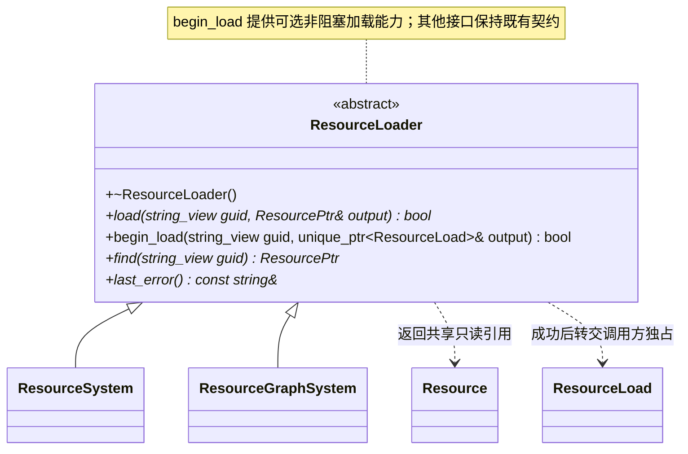
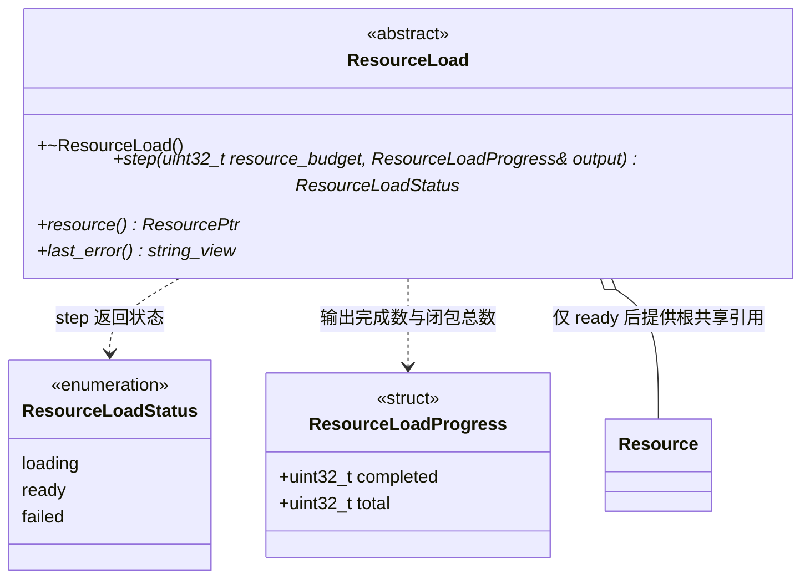

# 资源加载接口

[类图索引](../../class-diagrams/index.md) · [单项资源系统](resource-system.md) · [依赖图插件](../../plugins/runtime/class-diagrams/resource-graph.md)

```mermaid
classDiagram
    class ResourceLoader {
        <<abstract>>
        +~ResourceLoader()
        +load(string_view guid, ResourcePtr& output) bool*
        +begin_load(string_view guid, unique_ptr~ResourceLoad~& output) bool
        +find(string_view guid) ResourcePtr*
        +last_error() const string&*
    }
    class ResourceSystem
    class ResourceGraphSystem
    class Resource
    class ResourceLoad
    ResourceLoader <|-- ResourceSystem
    ResourceLoader <|-- ResourceGraphSystem
    ResourceLoader ..> Resource : 返回共享只读引用
    ResourceLoader ..> ResourceLoad : 成功后转交调用方独占
    note for ResourceLoader "begin_load 提供可选非阻塞加载能力；其他接口保持既有契约"
```

- 接口归 `runtime/resource/`，不引用任何具体插件。虚析构为 noexcept；`find` 为 const noexcept，`last_error` 为 const noexcept；状态和查询标注 nodiscard。
- `load` 显式同步加载一个请求目标，失败清空输出；是否组合依赖由所选实现决定。
- `find` 只查询实现已缓存的当前代际对象，不触发文件读取。命中返回共享引用，未命中返回空；核心单项实现不缓存，始终返回空。
- `ResourcePtr` 是 `std::shared_ptr<const Resource>` 的别名。调用方只持加载操作，不接触任务池、引用计数包装或编辑器身份。
- `last_error` 借用最近失败原因，随后操作可能改变其内容；返回状态仍是成功或失败的依据。

具体实现的公开契约分别维护在资源系统与资源依赖图插件图；此图只维护共同接口。

## 分步与后台加载操作

`begin_load` 返回由调用方显式推进的操作，允许跨帧加载目标的必要资源。宿主配置 ResourceSystem 的异步任务域后，实体读取和解码在后台执行；未配置时保留工具所需的同步分步模式。`load` 和 `Scene.Load` 保留同步语义。

```mermaid
classDiagram
    direction TB
    class ResourceLoad {
        <<abstract>>
        +~ResourceLoad()
        +step(uint32_t resource_budget, ResourceLoadProgress& output) ResourceLoadStatus*
        +resource() ResourcePtr*
        +last_error() string_view*
    }
    class ResourceLoadStatus {
        <<enumeration>>
        loading
        ready
        failed
    }
    class ResourceLoadProgress {
        <<struct>>
        +uint32_t completed
        +uint32_t total
    }
    class Resource
    ResourceLoad ..> ResourceLoadStatus : step 返回状态
    ResourceLoad ..> ResourceLoadProgress : 输出完成数与闭包总数
    ResourceLoad o-- Resource : 仅 ready 后提供根共享引用
```

- `ResourceLoad`、`ResourceLoadStatus`、`ResourceLoadProgress` 归核心 `engine` 命名空间。核心声明操作与计数结构；具体依赖遍历和缓存策略归所选加载器。
- `begin_load(guid, output)` 先清空输出，成功后转交尚未推进的操作，由调用方用 `unique_ptr` 独占。准备阶段只读取目标及依赖的目录元数据，不读取实体载荷。基础接口默认返回 false，表示不支持该能力；同步加载不要求启用依赖图插件。
- 操作固定目标 GUID、创建时的目录 generation 和所选加载器身份；核心单项操作与依赖图操作遵循相同失效条件。loading 期间目录换代、所选加载器变化或读取/校验失败，进入 `failed` 并释放候选引用。ready 后保留完整旧代快照，终态重复 step 不改变状态、计数或缓存；提交方仍须核对 generation。
- `step(resource_budget, output)` 每次最多完成预算数量的唯一资源；异步模式同时限制本次推进的候选窗口，完成前返回 loading，绝不等待 future；缓存命中或通过读取、解码和依赖校验均计一个完成项。预算 0 检查当前状态但不读取实体。返回时总是填写 `completed/total`；total 创建后固定，completed 单调且不超过 total。
- `resource()` 为 `const noexcept`，只在 ready 时返回完整根 ResourcePtr 的共享副本，其引用保持必要依赖闭包；loading/failed 返回空。`last_error()` 为 `const noexcept`，借用本操作独立保存的错误，ready 时为空。
- 析构为公共虚析构且 `noexcept`；未完成时取消，完成后释放本操作的根引用，不强制卸载其他使用者持有的资源。操作不可复制或移动，方法和销毁均在同一运行线程调用；借用的加载器与资源核心必须覆盖操作生命周期。状态和查询标注 `[[nodiscard]]`。

## 加载阶段与限制

| 阶段 | 完成依据 | 执行边界 |
| --- | --- | --- |
| 资源读取 | `completed == total` 且状态为 ready | 调用方每帧推进 step；计数只覆盖请求时声明的资源闭包 |
| 场景恢复 | `step_restore_scene()` 返回 ready | 主线程按节点数量与时间预算恢复候选；`commit_restore_scene()` 才切换活动所有权 |
| 图形准备 | 新场景首帧成功 | 贴图 CPU 准备可用后台任务，GPU 提交仍由渲染器执行，不计入资源读取进度 |

资源 ready 后保持操作及根引用，交给 WorldSystem 的分帧恢复候选；Scene 接管根资源后再释放操作。恢复失败或取消保留旧活动场景。`load_scene`/`Scene.Load` 继续提供显式同步完整恢复，不因配置后台加载而自动改变语义。

计数表示资源项数，不代表耗时或字节百分比。异步模式的外置实体读取、校验和解码在后台执行；场景恢复在主线程分帧执行，图形仍包含必须在渲染提交线程执行的工作，不承诺整个场景切换的毫秒上限。调用方在 step 之间返回正常主循环，不重入 tick/render；只有新场景首帧成功后才能报告整体就绪。取消立即放弃操作引用，已发出的 SDL I/O 和解码安全收尾且不会发布旧结果；不能抢占当前正在恢复的一个节点或正在执行的 GPU 提交；取消在各工作项边界生效。

宿主每帧派发 TaskSystem 完成委托并推进资源操作；依赖加载算法、缓存发布与所有权实现见[依赖图插件](../../plugins/runtime/class-diagrams/resource-graph.md#同步与异步复用)。

脚本 StepLoad 的 status 在资源 ready 后继续保持 loading，直到场景恢复候选 ready；因此 completed 等于 total 时仍可能处于 loading。该计数不加入节点数或 GPU 工作量，避免伪造百分比。
